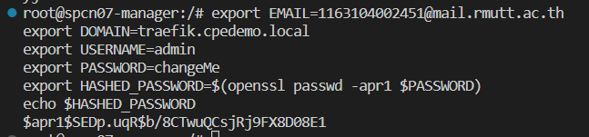

# **โฟลเดอร์แยกการทดลองสร้างต่างๆ**
## ขั้นตอนการสร้าง
 - [1.สร้างและใช้งาน Vm](#1สร้างและใช้งาน-vm)
 - [2.Stack และ Portainer](#2portainer)
 - [3.Revert proxy](#3revert-proxy)
 
 # 1.สร้างและใช้งาน Vm
- สร้าง Vm เบื้องต้นได้ที่
   * https://github.com/Pinchattaporn/SPCN-011
   * Vm spec
        * Ubuntu 22.04
        * CPU 2 cores
        * Ram 2 GB
        * HDD 32 GB

- เมื่อสร้าง Vm เสร็จแล้วทำการ clone ออกมา 3  Node ได้แก่
    * mannger (spcn07-manager)
    * work1 (spcn07-worker1)
    * work2 (spcn07-worker2)

- ทำการ Set Hostname ใหม่ ด้วยคำสั่ง
    *  hostnamectl set-hostname " ชื่อชื่อใหม่ที่เราต้องการตั้ง"
        * hostname ใหม่ของดิฉัน ได้แก่
            * spcn07-manager
            * spcn07-worker1
            * spcn07-worker2
- เช็คเลข ip ไม่ให้ซ้ำกันเพื่อทำการ Remote ssh ที่ Vscode
    * ติดตั้ง Extension ที่เกี่ยวกับงาน(ssh,wakatime)
    * เชื่อม ssh ไปยัง Vm ที่เราจะทำ Remote ssh
        * ssh root@172.31.1.176 (manager)
        * ssh root@172.31.1.163 (worker1)
        * ssh root@172.31.1.142 (worker2)

# 2.Stack และ Portainer
## Stack
    ในการสร้าง Docker swarm ถ้าสร้างโดยการใช้ CT อาจจะไม่รองรับ swarm ได้ครบถ้วน จึงต้องใช้ Vm แทน
- ติดตั้ง swarm โดยใช้คำสั่ง
    * docker swarm init (Node แรกของคลัสเตอร์)
       * จะได้ Url token มาแล้วเอาไป Run บน Worker Node พอเรารันเสร็จเราจะทราบว่าการ joy สมบูรณ์มั้ย
- ทำการ add worker to this swarm
    * docker node Is : เช็ครายการ Node ที่ทำการเชื่อมต่อ
    
  ผลลัพธ์

  
## Portainer
- ติดตั้ง Portainer CE

        curl -L https://downloads.portainer.io/ce2-17/portainer-agent-stack.yml -o portainer-agent-stack.yml

        docker stack deploy -c portainer-agent-stack.yml portainer 
   
   * Copy Command แล้วนำไปรันในเครื่อง Vm ทั้ง 3 Node ที่สร้างไว้ในข้อที่ผ่าน และทำการ deploy

 * ผลลัพธ์ 
    - เกิดการสร้าง Service 2 service

    
      

- เช็คโดยการเข้าใช้ Url
    * https://172.31.176:9443

    * ผลลัพธ์


 # 3.Revert proxy
 - ทำการรันคำสั่ง
    * สร้าง Network มารองรับ

            docker network create --driver=overlay traefik-public

    * ตรวจสอบ Network ที่ถูกสร้างใหม่

            docker network ls 
        
        * ผลลัพธ์


        

        * เช็คว่า Network ถูกสร้างสำเร็จมั้ยที่ 
        
                Portainer -> Network -> TRAEFIK-PUBLIC
            * ผลลัพธ์

       

- สร้าง label
    * Get ID Node

           export NODE_ID=$(docker info -f '{{.Swarm.NodeID}}') 
           echo $NODE_ID

    * สร้าง label


            docker node update --label-add traefik-public.traefik-public-certificates=true $NODE_ID

    

    * ปรับเปลี่ยนข้อมูล traefik ก่อนที่จะ export
        
        ```
        export EMAIL=user@smtp.com
        export DOMAIN=traefik.cpedemo.local
        export USERNAME=admin
        export PASSWORD=changeMe
        export HASHED_PASSWORD=$(openssl passwd -apr1 $PASSWORD)
        echo $HASHED_PASSWORD
        ```
    
    * ตัวอย่างการ set ข้อมูล

    

    * ตัวอย่างผลลัพธ์ การ export

    

- ทำการ deploy treafik stacks
    
        docker stack deploy -c traefik- host.yml traefik

    * Befor & After 
           
         * มีการเพิ่มของ Stack traefik

        

    

       

- ดูผลลัพธ์ที่ Url
    * http://traefik.cpedemo.local
    
    

- Ref.
    - https://youtu.be/KW25mzu7NTI
    - https://youtu.be/xv8uFJL14fA
    - https://youtu.be/UGEs5P5pKZ8
    - https://github.com/pitimon/dockerswarm-inhoure

